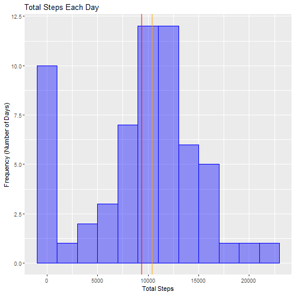
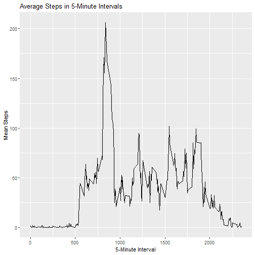
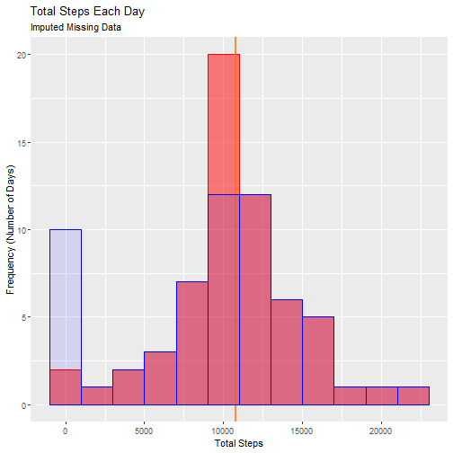
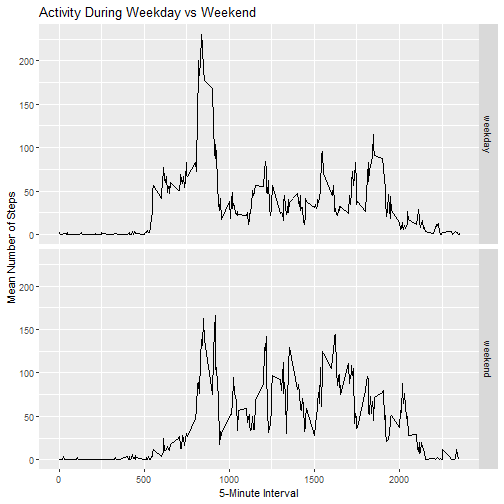

# PA1 Exercise
## Loading and preprocessing the data


```r
filAct <- "activity.csv"
if (!file.exists(filAct)) {
        errorCondition("Ensure Activity.csv exists in the working
                       directory")
        stop("Activity File is Missing")
        }
        
dfAct <- read.csv(filAct)

# Group by day and Sum the steps per day
# 
dfDays <- dfAct %>% group_by(date) %>% 
        summarize(SumSteps = sum(steps,na.rm = TRUE))
```

```
## `summarise()` ungrouping output (override with `.groups` argument)
```

## What is mean total number of steps taken per day?
### Ignoring missing data


```r
# Create histogram of Total Steps per day
g <- ggplot(dfDays)
gh <- g + geom_histogram(aes(SumSteps), binwidth = 2000, color = "blue", fill = "blue", alpha = 0.4)
ghl <- gh + labs(title = "Total Steps Each Day", x = "Total Steps", y = "Frequency (Number of Days)")
ghlm <- ghl + geom_vline(xintercept = mean(dfDays$SumSteps), size = 1, color = "red", alpha = 0.5)
ghlm + geom_vline(xintercept = median(dfDays$SumSteps), size = 1, color = "orange", alpha = 0.5)
```



```r
# Report Max and Mean
MeanSteps <- round(mean(dfDays$SumSteps))
MedSteps <- median(dfDays$SumSteps)
```

The Mean daily number of steps is 9354.  

The Median daily number of steps is 10395.

## What is the average daily activity pattern?


```r
# Build a dataframe of intervals and mean steps
dfIntervals <- dfAct %>% group_by(interval) %>%                            summarise(MeanSteps = mean(steps, na.rm = TRUE))
```

```
## `summarise()` ungrouping output (override with `.groups` argument)
```

```r
#Build the line plot
g <- ggplot(dfIntervals, aes(x = interval, y = MeanSteps))
gp <- g + geom_line()
gpl <- gp+ labs(title = "Average Steps in 5-Minute Intervals", 
                x = "5-Minute Interval", y = "Mean Steps")
gpl
```



```r
# Report the Interval with the max # of mean steps
dfMax <- dfIntervals[which.max(dfIntervals$MeanSteps),]
dfMax
```

```
## # A tibble: 1 x 2
##   interval MeanSteps
##      <int>     <dbl>
## 1      835      206.
```

The maximum number of mean steps is 206 occurring on the 835 interval.  

## Imputing missing values


```r
# Build a dataframe of a count of missing values
dfMissing <- sapply(dfAct, function(x) sum(is.na(x)))

# Build a dataframe with missing data filled with average steps 
# in that interval
dfImpute <- dfAct
dfImpute$steps <- ifelse(is.na(dfImpute$steps) == TRUE, 
                       dfIntervals$MeanSteps[dfIntervals$interval
                        %in% dfImpute$interval], dfImpute$steps)
dfImputeDays <- dfImpute %>% group_by(date) %>% 
        summarize(SumSteps = sum(steps))
```

```
## `summarise()` ungrouping output (override with `.groups` argument)
```

```r
# Create histogram of Total Steps per day
ig <- ggplot(dfImputeDays)
igh <- ig + geom_histogram(aes(SumSteps), binwidth = 2000, color = "red",
                           fill = "red", alpha = 0.5)
ighl <- igh + labs(title = "Total Steps Each Day", 
                   subtitle = "Imputed Missing Data",
                   x = "Total Steps", 
                   y = "Frequency (Number of Days)")
ighlm <- ighl + geom_vline(xintercept = mean(dfImputeDays$SumSteps), 
                           size = 1, color = "red", alpha = 0.5)
ighlmv <- ighlm + geom_vline(xintercept = median(dfImputeDays$SumSteps),
                             size = 1, color = "orange", alpha = 0.5)
ighlmv + geom_histogram(data = dfDays, aes(SumSteps), binwidth = 2000, 
                        color = "blue", fill = "blue", alpha = 0.1)
```



```r
# Report Max and Mean
MeanStepsI <- round(mean(dfImputeDays$SumSteps), digits = 0)
MedStepsI <- round(median(dfImputeDays$SumSteps), digits = 0)
```

After Imputing missing values, the Mean daily number of steps is 10766 as compared to 9354 with missing values.    

After Imputing missing values, the Median daily number of steps is 10766 as compared to 10395 with missing values.  

## Are there differences in activity patterns between weekdays and weekends?


```r
# Build dataframe with an additional column describing "weekend" or 
# "weekday
# 
dfDayOfWk <- dfImpute %>% mutate(WkDay = weekdays(as.Date(dfImpute$date)))

# Change name of the day of the week to "weekday" or "weekend" and make it 
# a factor.
dfDayOfWk$WkDay <- ifelse(dfDayOfWk$WkDay %in% c("Saturday", "Sunday"), 
                          "weekend", "weekday")
dfDayOfWk$WkDay <- factor(dfDayOfWk$WkDay)

# Get the Intervals and Mean per day by weekday value
dfIntWkDay <- dfDayOfWk %>% group_by(interval,WkDay) %>% 
        summarise(MeanSteps = mean(steps))
```

```
## `summarise()` regrouping output by 'interval' (override with `.groups` argument)
```

```r
# Now plot the result
# 
g <- ggplot(dfIntWkDay)
gp <- g + geom_line(aes(x=interval, y = MeanSteps, group = WkDay)) + 
        facet_grid(WkDay~.)
gp + labs(title = "Activity During Weekday vs Weekend", 
          y = "Mean Number of Steps", x = "5-Minute Interval")
```



